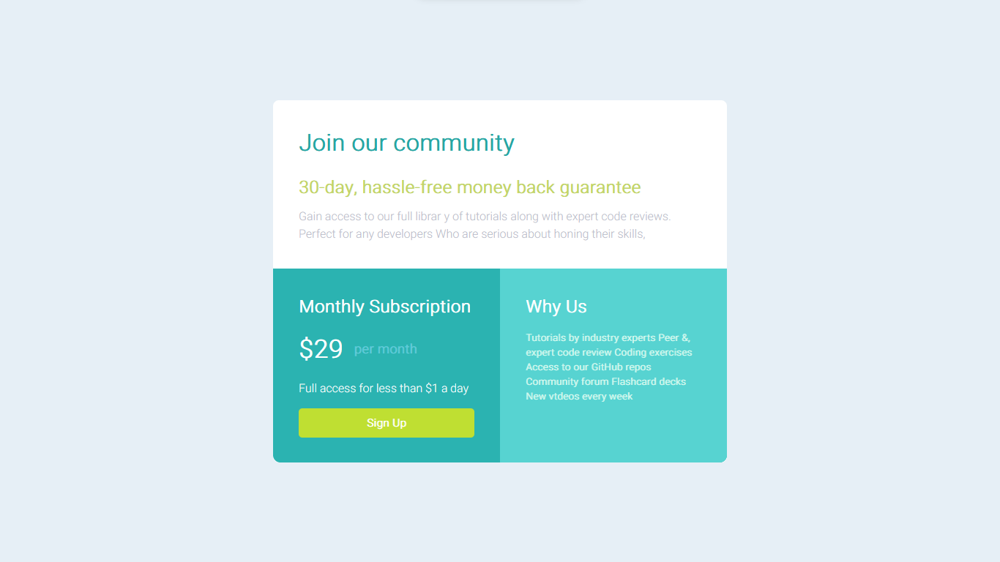

README.md
<h1 align="center"> Challenge FrontEnd Mentor </h1>

 

  

## 🚀 Tecnologias

Esse projeto foi desenvolvido com as seguintes tecnologias:

- HTML e CSS

## 💻 Projeto

- Challenge Frontend Mentor Grade de Preço

## 💻 Demonstração

https://pamplona-c.github.io/Frontend-Mentor-Challenge-02/

---

Feito por mim!